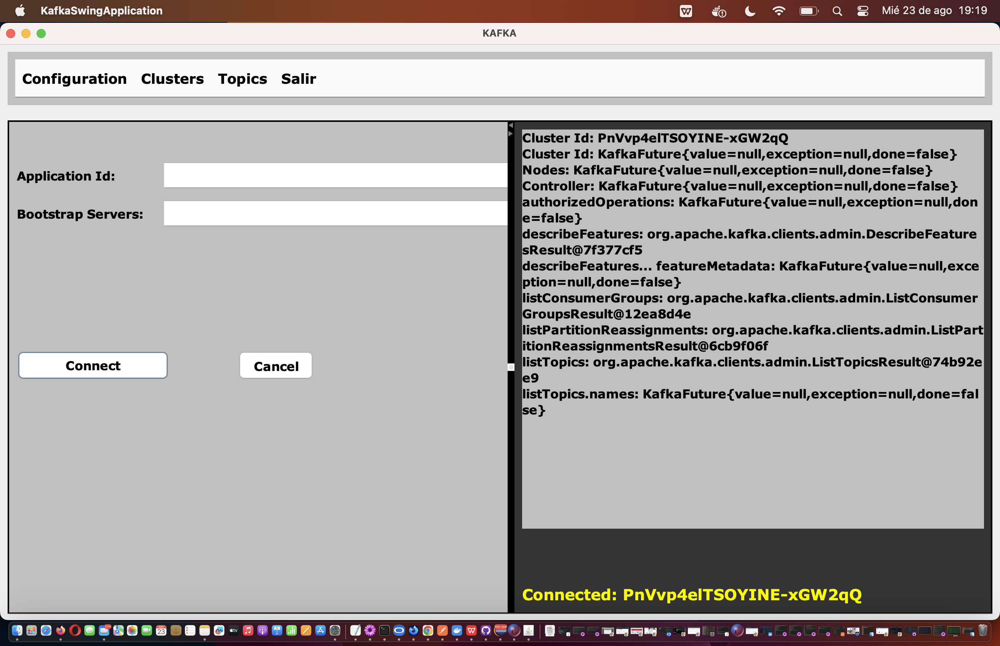

# KAFKA SWING

## Synopsis

The project is a simple Java program to connect to Kafka. It uses Swing to create the GUI (Graphical User Interface).

## Motivation

I wanted to create an application that connects to Kafka to create, list, and delete topics.

## Pre Requirements

- You need to have a running Kafka server.

## Running the Application

To run the application go to KafkaSwingApplication and run it.
You'll see this screen:

## 1) Go to Configuration menu and select Configuration:

By default you'll get an Application Id and Bootstrap Servers (localhost:9092).
Information that is needed to establish a connection.

When you click on Connect button you'll see the following screen:

## 2) Go to Clusters menu and select Clusters:

When you click on List Clusters button you'll see the following screen:

## 3) Go to Topics menu and select Create Topic:

Fill the information:

Click on Save button:

## 4) Go to Topics menu and select List Topics:

Click on List Topics button:

After List Topics button clicked:

When you select the topic, you'll see the description:

## License

All work is under Apache 2.0 license